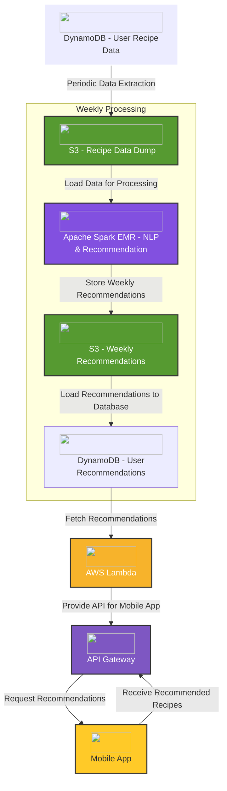

# Bring Labs recommender
==============================

A work performed for BringLabs for an interview with them

- [Bring Labs recommender](#bring-labs-recommender)
  - [Task description](#task-description)
    - [Current way to add a recipe:](#current-way-to-add-a-recipe)
      - [1 - Add the ingredients directly in the app](#1---add-the-ingredients-directly-in-the-app)
      - [2 - Add the URL of the recipe](#2---add-the-url-of-the-recipe)
  - [Possible Infrastructure](#possible-infrastructure)
    - [Custom Approach](#custom-approach)
    - [Using AWS SageMaker](#using-aws-sagemaker)
    - [SparkML: Dataset used to emulate user data](#sparkml-dataset-used-to-emulate-user-data)
  - [Installation](#installation)
    - [Install the requirements](#install-the-requirements)
    - [Fill in the .env file](#fill-in-the-env-file)
    - [Pyspark for local testing](#pyspark-for-local-testing)
      - [Using pip](#using-pip)


## Task description

In the Bring! App users are able to import recipes, more specifically the required ingredients,
from websites (e.g. chefkoch.de). Therefore we have data about which recipes which user
imported. Now we want to be able to recommend recipes to the user on a weekly basis. Please
describe how you would design such a system including data preparation, how you would
conduct the research to find the best model and how you would integrate such a system into
our server infrastructure and finally into a mobile application.

### Current way to add a recipe:

#### 1 - Add the ingredients directly in the app

The user adds the ingredients manually in the app. That and the title and the description of the recipe + ingredients. This is probably the best and most common way to add a recipe to the app.


#### 2 - Add the URL of the recipe


The user adds the URL of the recipe and the app tries to extract the ingredients from the website (at the very least, this is my assumption).
This is a trickier use case since we would need to access the website and extract the ingredients from the website. This is a more complex task and would require more work to be done.

Work that I kind of did and enjoyed doing ^^'

This is summarized in the basic [recipeCrawler](recipeCrawler) project that I created to extract the ingredients from a recipe website. It is extremely basic but is a nice step to start with.

**Assumption**:
For this short project, I will assume that the user data is already stored in a database and that the recipes are stored in a DynamoDB database. The scripts mentioned above would just be a part of the data pipeline that would be used to complete existing recipes with missing data (like ingredients).


## Possible Infrastructure

**Assumptions**

- The user data and the recipes are stored in a DynamoDB database.
- No additional data fetching is necessary to get the complete recipe (ex: if the user adds the URL of the recipe, the app already fetches the ingredients).
- The process of providing recommendations is happening on a **weekly basis**.
- The recommendations are stored in a DynamoDB database.

### Custom Approach

Leveraging existing frameworks such as Apache Spark and AWS Lambda, we could create a pipeline that would extract the data from the DynamoDB database, process it using Apache Spark, and then store the recommendations in a DynamoDB database.



### Using AWS SageMaker

Sagemaker already offers a lot of tools that could be used to perform the tasks of data processing and model training, notably for recommendation systems.

We would leverage the same backbone and use Sagamker or amazon products for recommendation systems, such as Personalize or Factorization Machines to generate the recommendations.

```mermaid
graph TD
    dynamoUserData[<img src='https://icon.icepanel.io/AWS/svg/Database/DynamoDB.svg' width='40' height='40' /> DynamoDB - User Recipe Data] -->|Periodic Data Extraction| s3DataDump[<img src='https://icon.icepanel.io/AWS/svg/Storage/Simple-Storage-Service.svg' width='40' height='40' /> S3 - Recipe Data Dump]
    s3DataDump -->|Data Preparation| sagemakerProcessing[<img src='https://icon.icepanel.io/AWS/svg/Machine-Learning/SageMaker.svg' width='40' height='40' /> SageMaker - Data Processing]
    sagemakerProcessing -->|Model Training| sagemakerTraining[<img src='https://icon.icepanel.io/AWS/svg/Machine-Learning/SageMaker.svg' width='40' height='40' /> SageMaker - Model Training]
    sagemakerTraining -->|Batch Inference| s3RecommendationOutput[<img src='https://icon.icepanel.io/AWS/svg/Storage/Simple-Storage-Service.svg' width='40' height='40' /> S3 - Weekly Recommendations]
    s3RecommendationOutput -->|Load Recommendations to Database| dynamoUserRecommendations[<img src='https://icon.icepanel.io/AWS/svg/Database/DynamoDB.svg' width='40' height='40' /> DynamoDB - User Recommendations]
    dynamoUserRecommendations -->|Fetch Recommendations| awsLambda[<img src='https://icon.icepanel.io/AWS/svg/Compute/Lambda.svg' width='40' height='40' /> AWS Lambda]
    awsLambda -->|Provide API for Mobile App| apiGateway[<img src='https://icon.icepanel.io/AWS/svg/App-Integration/API-Gateway.svg' width='40' height='40' /> API Gateway]
    apiGateway -->|Request Recommendations| mobileApp[<img src='https://icon.icepanel.io/AWS/svg/App-Integration/Console-Mobile-Application.svg' width='40' height='40' /> Mobile App]

    mobileApp -->|Receive Recommended Recipes| apiGateway


    subgraph Weekly Processing
        s3DataDump
        sagemakerProcessing
        sagemakerProcessing
        sagemakerTraining
        sagemakerTraining
        s3RecommendationOutput
        s3RecommendationOutput
        dynamoUserRecommendations
    end


    style dynamoUserData dynamoUserRecommendations fill:##a1a8eb,stroke:#fff,stroke-width:2px,color:#333
    style s3DataDump fill:#569a31,stroke:#333,stroke-width:2px,color:#fff
    style sagemakerProcessing fill:#8250e0,stroke:#333,stroke-width:2px,color:#fff
    style sagemakerTraining fill:#8250e0,stroke:#333,stroke-width:2px,color:#fff
    style s3RecommendationOutput fill:#569a31,stroke:#333,stroke-width:2px,color:#fff

    style awsLambda fill:#f7b32b,stroke:#333,stroke-width:2px,color:#fff
    style apiGateway fill:#7e57c2,stroke:#333,stroke-width:2px,color:#fff
    style mobileApp fill:#ffca28,stroke:#333,stroke-width:2px,color:#333
```




### SparkML: Dataset used to emulate user data

Used the RecipeNLG dataset available [here](https://clickhouse.com/docs/en/getting-started/example-datasets/recipes)

This dataset is fairly simple and offers the advantage of being free to use and also to have performed one of the main tasks of the project, which is to identify the ingredients for a recipe using NER (Named Entity Recognition) techniques.

This would allow us to generate (for fun and demonstration pruposes) a false dataset of users that already have imported recipes and then use this dataset to train a model that would recommend recipes to the users.

The dataset is generated via the following notebook: [Generate User Data](notebooks/generateDataset.ipynb)

## Installation

### Install the requirements

```bash
pip install -r requirements.txt
```

### Fill in the .env file

Use the `.env.templeate` file to create a `.env` file with the necessary environment variables.

The variable OPENAI_API_KEY is necessary to use the OpenAI API to generate the recipe descriptions for the subproject [recipeCrawler](recipeCrawler).


### Pyspark for local testing

To install pyspark for local testing, if you don't have it already, please follow the instructions below:

#### Using pip

1. **Install Java** (if you haven't already):
   Ensure you have Java installed, as PySpark requires it. You can download it from the [Oracle website](https://www.oracle.com/java/technologies/javase-jdk11-downloads.html) or use a package manager like `apt` or `brew`.

   ```bash
   sudo apt update
   sudo apt install default-jdk
   ```

   Check if Java is installed:

   ```bash
   java -version
   ```

2. **Install PySpark**:
   You can use `pip` to install PySpark:

   ```bash
   pip install pyspark
   ```

3. **Verify the Installation**:
   You can verify the installation by opening a Python shell and trying to import PySpark:

   ```python
   python -c "import pyspark; print(pyspark.__version__)"
   ```
